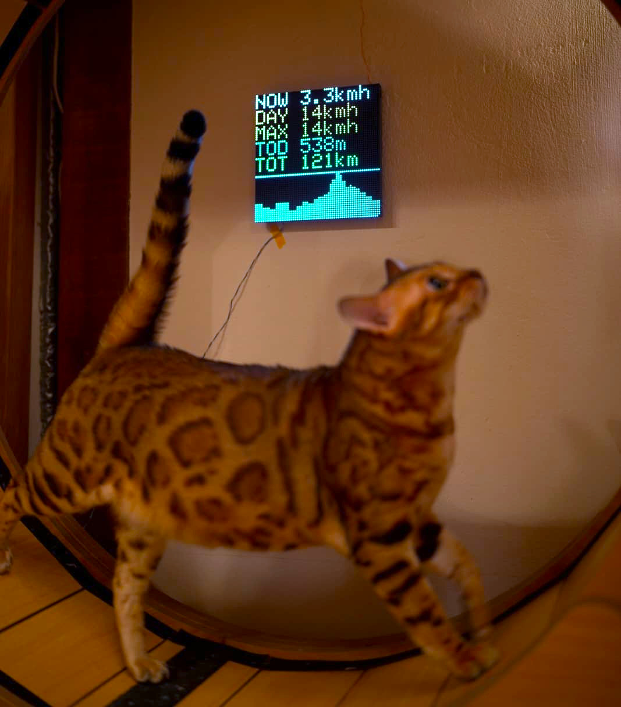
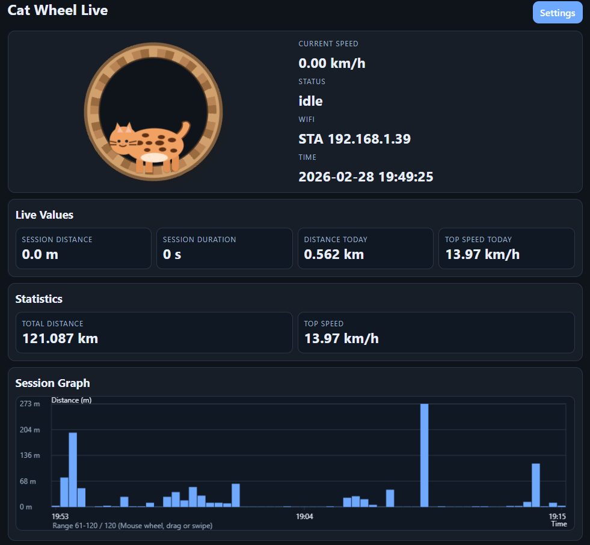

# Cat Wheel Tracker (ESP32-S3 + HUB75 Matrix)

## Overview
Cat Wheel Tracker is an ESP-IDF project for monitoring a cat exercise wheel.
It reads wheel pulses from an LM393 photoelectric sensor, calculates activity metrics, stores data in flash, and shows live values on a 64x64 HUB75 RGB LED matrix.

The device also hosts a web interface for live monitoring, configuration, and backup/restore.




## Main Features
- Live speed, distance, and session tracking
- Daily and total statistics:
  - Total Distance
  - Distance Today
  - Top Speed
  - Top Speed Today
- Session logging with timestamp, duration, distance, average speed, and top speed
- Persistent storage in NVS (flash)
- 64x64 RGB matrix output with configurable lines, colors, graph, and brightness profiles
- Web UI:
  - Live dashboard
  - Settings page
  - Wi-Fi setup
  - mDNS
  - Backup download/upload (JSON)
  - Display off-time window and day/night brightness schedules

## Bill of Materials (BOM)
- LM393 Photoelectric Correlation Sensor
- ESP32S3-WROOM-1-N16R8
- 64x64 LED Matrix (HUB75, P3, 1/32 scan)
- LM2596S DC-DC Converter

## Matrix Pin Mapping
- `GPIO1` = `R1`
- `GPIO2` = `G1`
- `GPIO4` = `B1`
- `GPIO5` = `R2`
- `GPIO6` = `G2`
- `GPIO7` = `B2`
- `GPIO8` = `E` (labeled as `LE` on some panels)
- `GPIO9` = `A`
- `GPIO10` = `B`
- `GPIO11` = `C`
- `GPIO12` = `D`
- `GPIO13` = `CLK`
- `GPIO14` = `LAT`
- `GPIO15` = `OE`

Sensor input:
- `GPIO18` = sensor pulse input

## Build and Flash (ESP-IDF)
From the project root:

```bash
idf.py set-target esp32s3
idf.py build
idf.py -p COMx flash monitor
```

Replace `COMx` with your serial port (for example `COM8`).

## Wifi Setup
- If no STA Wi-Fi is configured or connection fails, the device starts an AP for setup.
- Default AP SSID is defined in code (`CatWheelSetup`).
- Open:
  - `http://192.168.4.1` in AP mode
  - or the STA IP shown in logs/status once connected

- If STA Wi-Fi is connected, you can connect to the device over `http://catwheel.local/` or over the device's assigned IP address.

## Data and Backups
- Runtime data and configuration are stored in NVS.
- Use the settings page to export/import JSON backups.

## Notes
- Wheel diameter is configured through `meters_per_pulse` (default based on 1.0 m wheel and 4 pulses/revolution).
- Maximum valid speed is limited in firmware to reduce false spikes.
